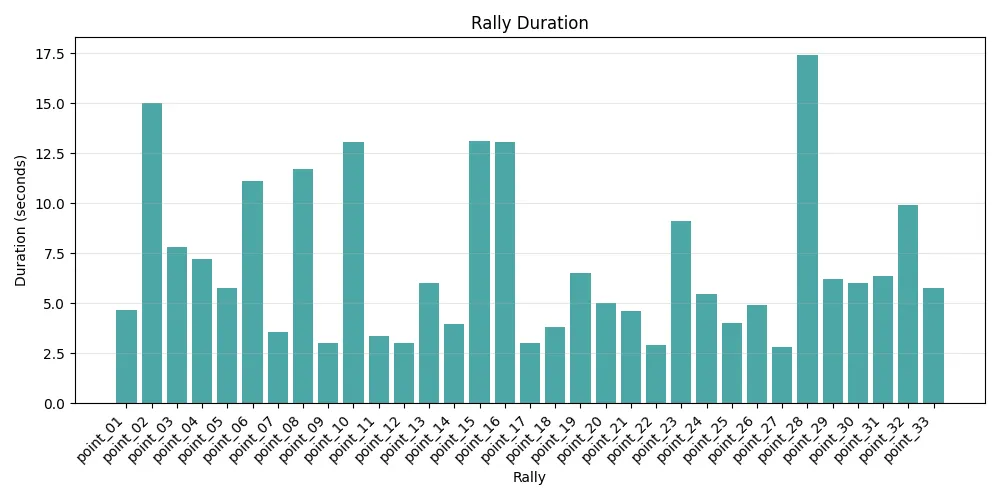
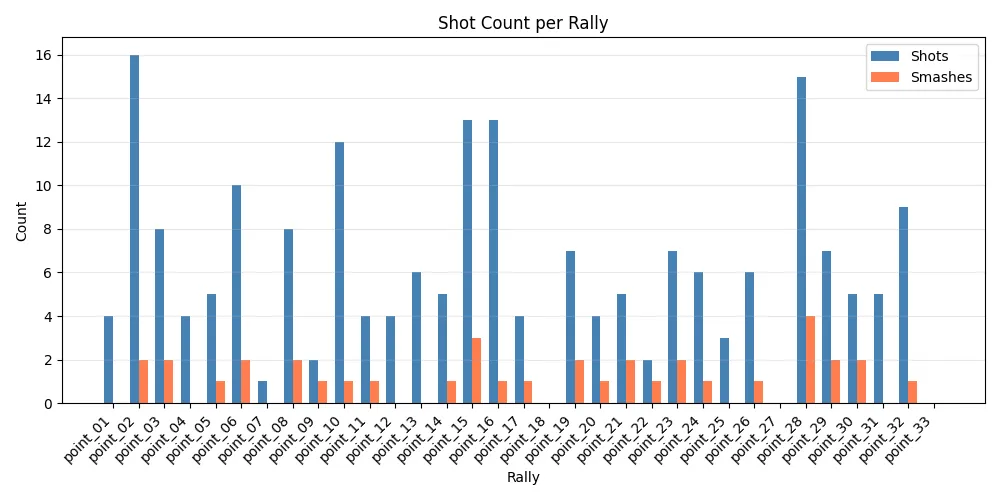
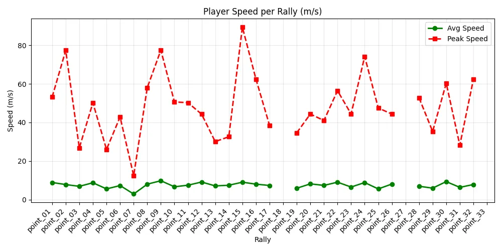
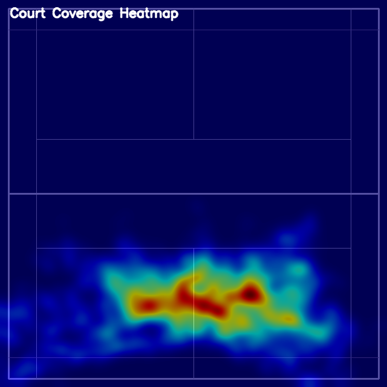
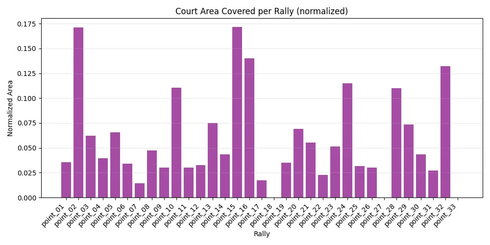

# Badminton Point Chunking (Singles, target player at bottom)

This project splits a singles badminton game video into point-wise chunks.

Assumptions:

- Target player is always in bottom half of the frame.
- One video uses one fixed side-angle (no side switch handling needed in that file).
- No scoreboard dependency.

## 1) Setup

```powershell
python -m venv .venv
.\.venv\Scripts\Activate.ps1
pip install -r requirements.txt
```

## 2) Run chunking

```powershell
python src/chunk_points.py --video "E:\videos\match.mp4" --output-dir "E:\videos\chunks"
```

Use trained model (recommended after training):

```powershell
python src/chunk_points.py --video "E:\videos\match.mp4" --output-dir "E:\videos\chunks" --model "E:\personalprojs\bt\src\source\point_activity.joblib"
```

## 2.1) Drag/drop UI popup

Start application:

```powershell
cd E:\personalprojs\bt
.\venv\Scripts\Activate.ps1
pip install -r requirements.txt
python src/ui_app.py
```

Then open the URL printed in terminal (usually `http://127.0.0.1:7860`).

If port 7860 is busy, run on 7861:

```powershell
python -c "from src.ui_app import create_app; app=create_app(); app.launch(inbrowser=True,server_port=7861,allowed_paths=['E:/personalprojs/bt/src/outputs'])"
```

What you get:

- Drag/drop input video.
- Optional upload of trained `.joblib` model.
- Click **Process Video**.
- See detected segments JSON and playable trimmed point clips in the UI.
- Outputs are saved in `outputs/<video_name_timestamp>/point_XX/point_XX.mp4`.

Output structure:

- `chunks/segments.json`
- `chunks/activity_signal.csv`
- `chunks/point_01/point_01.mp4`
- `chunks/point_02/point_02.mp4`
- ...

## 3) Optional: Train ML model from labeled points

Detailed step-by-step instructions: see [TRAINING_GUIDE.md](TRAINING_GUIDE.md).

Create an items JSON file:
Sample json to lable the data of full videos

```json
[
  {
    "video": "E:/videos/match_01.mp4",
    "points": [
      { "start_sec": 12.45, "end_sec": 21.9 },
      { "start_sec": 28.1, "end_sec": 36.7 },
      { "start_sec": 43.25, "end_sec": 55.02 }
    ]
  },
  {
    "video": "E:/videos/match_02.mp4",
    "points": [
      { "start_sec": 9.8, "end_sec": 18.35 },
      { "start_sec": 24.4, "end_sec": 41.12 }
    ]
  }
]
```

Build dataset and train model (for offline experimentation):

```powershell
python src/build_training_npz.py --items-json "E:\videos\train_items.json" --output "E:\videos\dataset.npz"
python src/train_point_activity_model.py --dataset "E:\videos\dataset.npz" --output-model "E:\videos\point_activity.joblib"
```

If you have extra short/long rally clips and break clips, include them during dataset build:

```powershell
python src/build_training_npz.py --items-json "E:\videos\train_items.json" --output "E:\videos\dataset.npz" --rally-clips-dir "E:\videos\short_clips\short_rally" --rally-clips-dir "E:\videos\short_clips\long_rally" --break-clips-dir "E:\videos\short_clips\break" --break-clips-dir "E:\videos\short_clips\towel_break"
```

For rally-only chunk output (reduce break chunks), use:

```powershell
python src/chunk_points.py --video "E:\videos\match.mp4" --output-dir "E:\videos\chunks" --model "E:\videos\point_activity.joblib" --max-rally-sec 45
```

## 4) Tuning for better accuracy

- Increase `--start-confirm-sec` and `--end-confirm-sec` to reduce false boundaries.
- Adjust `--threshold` if too many/too few points are detected.
- Start values:
  - `--threshold 0.5`
  - `--start-confirm-sec 0.6`
  - `--end-confirm-sec 1.0`
  - `--min-rally-sec 2.0`
  - `--min-gap-sec 1.2`

## 5) Results

The following result visualizations are available in `src/results`:

### Rally duration distribution



### Shorts count



### Player speed trend



### Court heatmap



### Court area coverage


